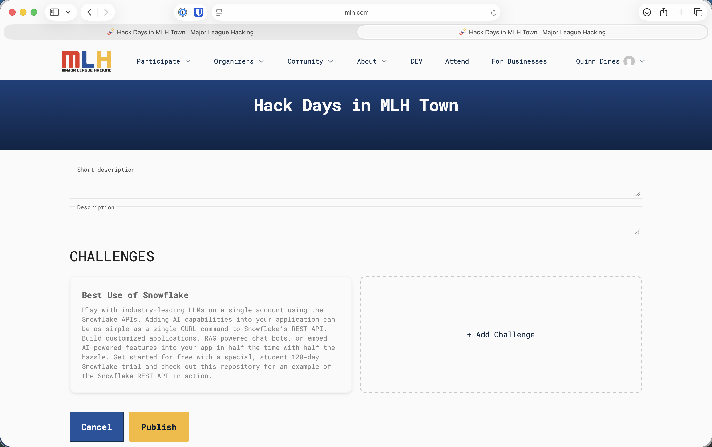
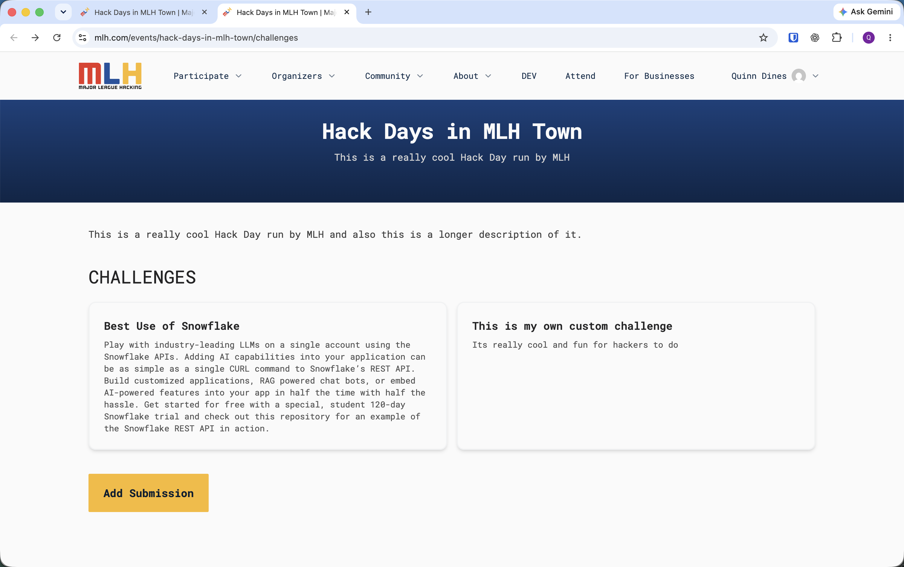
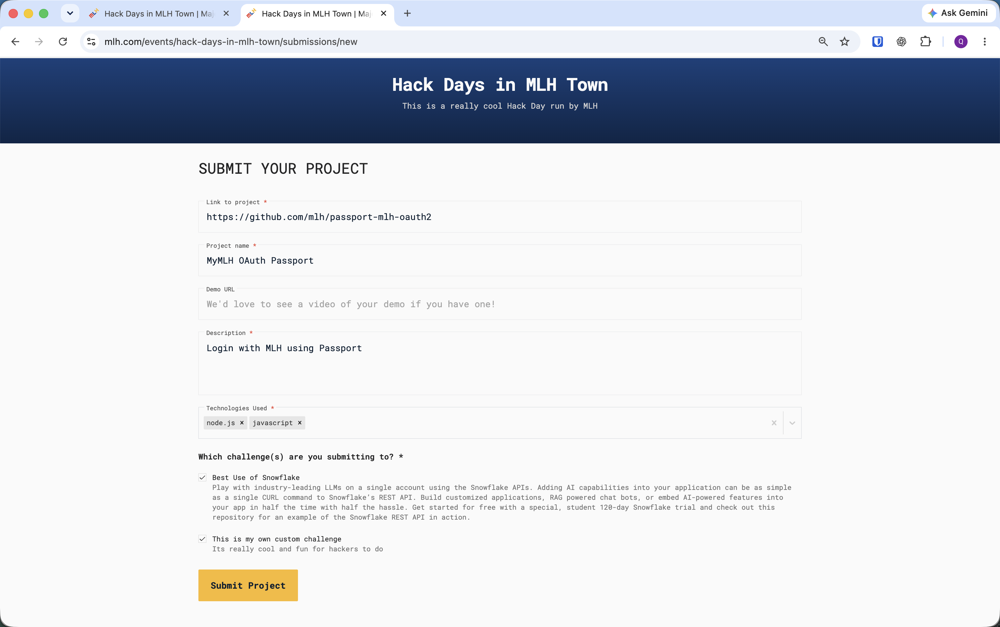
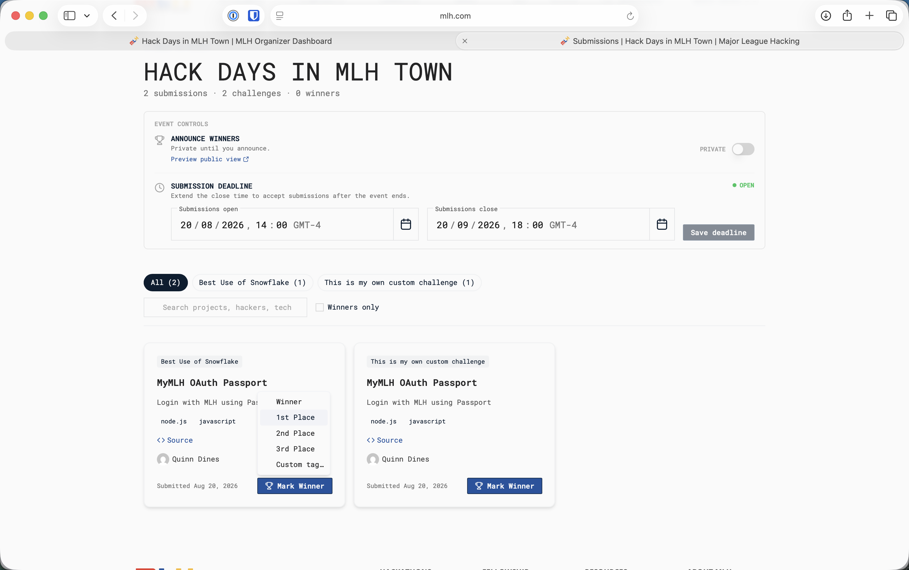
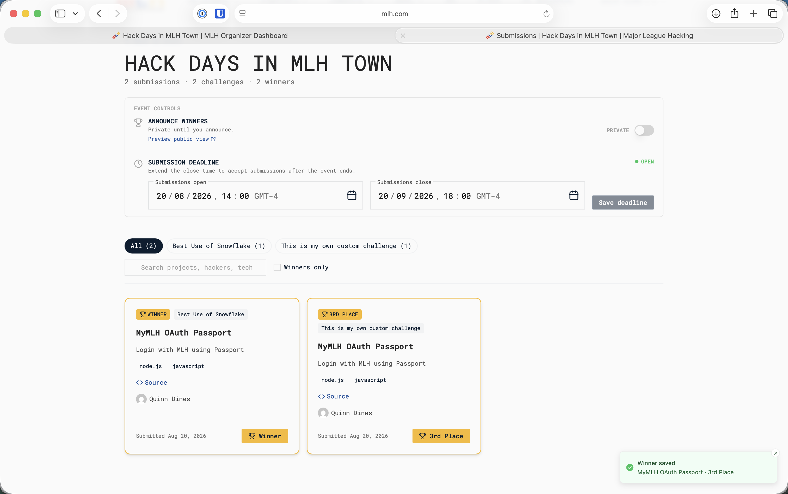
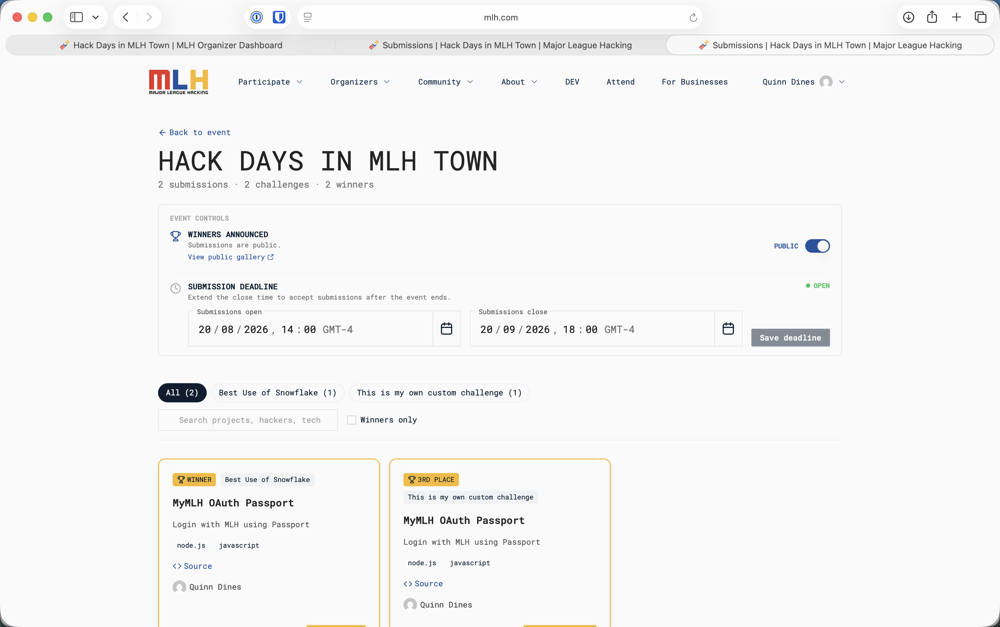

# Project Submissions and Judging for Hacktoberfest Hack Day

This page applies to approved `Hacktoberfest Hack Day` events. OrganizerHQ Challenges is mandatory for every Hacktoberfest Hack Day event and cannot be replaced by another submission platform.

## When Project Work May Begin

All project-specific work must be done during the Hack Day. Teams may form and brainstorm beforehand, use an idea they had before the event, and use generally available libraries, frameworks, open-source code, templates, or starter repositories.

Teams may not reuse code or other project materials they created for the submission before the event. Working on a project before the Fest and then open-sourcing it solely so the team can reuse that work is not allowed. Judges should consider only the work completed during the Hack Day.

These expectations mirror the [MLH Standard Hackathon Rules](https://github.com/MLH/mlh-policies/blob/main/standard-hackathon-rules.md). Explain them during the opening and apply them consistently to every team.

## Set Up the Challenges

Hacktoberfest Hack Day organizers may run one, several, or all of the [open-source prize challenges](fest-planning-guide/open-source-prize-categories.md). Create each challenge you have chosen in OrganizerHQ:

1. Open the public event page while signed in as an organizer.
2. Select **Edit Event**.
3. In **Challenges**, select **+ Add Challenge**.
4. Use the exact challenge name and requirements from this handbook, then select **Publish**.
5. Return to the public **Challenges** page and confirm that every challenge your Fest is running appears.

<figure><figcaption>
Add each open-source prize challenge your Fest has chosen to run.
</figcaption></figure>

If the MLH Hacktoberfest team assigns your event a Hack Days partner prize category, it appears automatically. Do not create a duplicate or add a partner category that MLH did not assign.

## Set the Submission Window

An organizer controls when teams can submit:

1. Open the public event page while signed in as an organizer.
2. Select **Manage Submissions**.
3. Under **Submission Deadline**, set the **Submissions open** and **Submissions close** date and time.
4. Select **Save deadline**.
5. Check the status at the right of the section. It shows **OPEN** while submissions are available.

Open submissions during project time and close them at the project deadline, before judging begins. If the deadline changes, update it here and tell every team.

<figure><figcaption>
Set and save the submission window from Manage Submissions.
</figcaption></figure>

## Before Project Work Begins

Tell participants:

* The exact submission deadline
* Which open-source challenges and assigned partner category are available
* The project-work rule above
* The required project information
* The demo format and time limit
* The judging criteria
* That every project being judged must be submitted and select every challenge it is entering

Open the **Challenges** page yourself and confirm that every category your event is running appears correctly. The **Add Submission** button becomes available only during the saved submission window.

## How Teams Submit Projects

Participants must register through OrganizerHQ and check in at the venue. One team member should then submit the project on behalf of the team:

1. Sign in using the account used to register for the event.
2. Select **Challenges** in the “View and submit challenges for this event” banner.
3. Select **Add Submission**.
4. Enter the project link, project name, description, and technologies used.
5. Add a demo URL if the team has one.
6. Under **Which challenge(s) are you submitting to?**, select every open-source challenge and assigned partner category the project is eligible to enter.
7. Select **Submit Project** before the deadline.

<figure><figcaption>
Teams start from the event's Challenges page while submissions are open.
</figcaption></figure>

<figure><figcaption>
Complete the required project fields and select every eligible challenge before submitting.
</figcaption></figure>

For open-source challenges, the project link must be a public GitHub repository and the repository must make its open-source license clear. The submission form does not include a separate license-attestation field.


The same project can appear once for every challenge it selected, and the total shown in Manage Submissions may count those challenge entries. This is expected; do not treat them as duplicate project forms.


## Verify Every Project Before Judging

Return to **Manage Submissions** before judging begins:

1. Identify each unique project in the **All** view and compare it with the teams scheduled to present. Do not rely on the headline total when projects entered more than one challenge.
2. Use the challenge tabs to confirm that each open-source challenge and assigned partner category has the expected entries.
3. Search by project, hacker, or technology when you need to find a specific submission.
4. Ask a missing team to submit while the window remains open. Apply the same deadline policy to every team.
5. Confirm that the submission window is closed when judging begins, then refresh the list.

<figure><figcaption>
Review unique projects and use each challenge filter to confirm coverage before judging.
</figcaption></figure>

## Judge Each Challenge

Give every eligible submission the same opportunity to be reviewed. Judge each project against the relevant challenge definition and confirm its repository, license, model, harness, or partner-technology requirements before selecting a winner.

A simple rubric should consider:

| Criterion | What judges should consider |
| --- | --- |
| Technical implementation | Does the project work, and how effectively does it use the chosen technology? |
| Creativity | Is the idea or implementation distinctive? |
| Learning and ambition | What did the team learn or attempt during the Hack Day? |
| Demo and clarity | Can the team clearly explain the problem, solution, and implementation? |
| Challenge eligibility | Does the project satisfy the chosen open-source or assigned partner category requirements? |

Tell judges how to handle ties before judging starts. A judge should disclose a close relationship with a team and recuse themselves when that relationship could affect the result.

Each chosen open-source challenge has one winning team. Every member of that team receives a DEV Badge on their DEV account. Any assigned Hack Days partner prize category uses the prize and eligibility instructions supplied for that category. Hacktoberfest does not use pull-request counts as the basis for these prizes.

## Mark Every Winner

Complete this process before announcing results in the room:

1. In **Manage Submissions**, filter to the relevant challenge.
2. Confirm that the selected project appears under that challenge and meets its requirements.
3. Select **Mark Winner** on the project card.
4. Select **Winner** from the menu.
5. Confirm that the card has a gold **WINNER** badge and that the page reports **Winner saved**.
6. Repeat for every open-source challenge your Fest ran and every partner category MLH assigned.

<figure><figcaption>
Select Winner for the winning project in each challenge.
</figcaption></figure>

<figure><figcaption>
Verify the gold Winner badge and saved confirmation before moving on.
</figcaption></figure>

Keep **Announce Winners** set to **PRIVATE** while judging and checking results.

## Announce Winners and Publish the Gallery

After every winner is correct and you are ready to announce the results:

1. Use **Preview public view** to check how the gallery will appear.
2. In **Announce Winners**, switch the toggle from **PRIVATE** to **PUBLIC**.
3. Confirm that the section now says **WINNERS ANNOUNCED** and **Submissions are public**.
4. Select **View public gallery** and check the published projects and winner labels.
5. Announce the results in the room exactly as they appear in OrganizerHQ.

<figure><figcaption>
Switch Announce Winners to Public only after every result has been checked.
</figcaption></figure>


Making winners public also publishes the event's project gallery, including non-winning submissions. Check the projects before switching the toggle.

